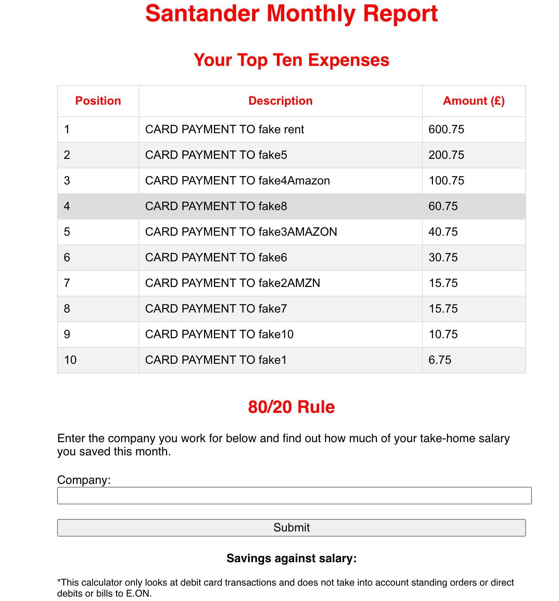

# Santander Monthly Account Report

This is a front-end web app for Santander account holders. A user should download a text file of their statement over a monthly period. They can then use this app to retrieve a summary of their transactions. I have included a MockStatementFile.txt for a user to test the app. The next steps would be to add a back-end so that users can log-in and save their monthly data.

## Get Started

```sh
git clone && cd Santander-account-report
npm install
npm start
```

1. upload your text file to view top ten expenses.
2. Type 'fake company' in form and submit to view eighty twenty rule.

## Testing

To run tests:
```sh
npm test
```

## Tech used
- React

## Mock-up

